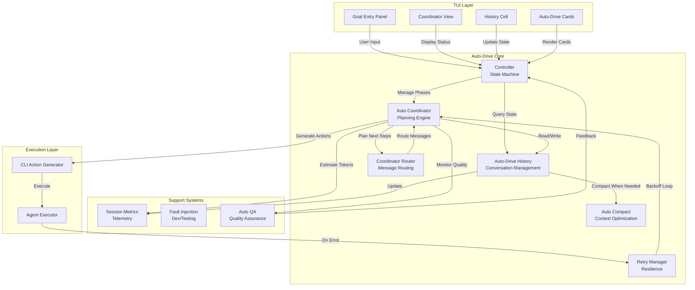
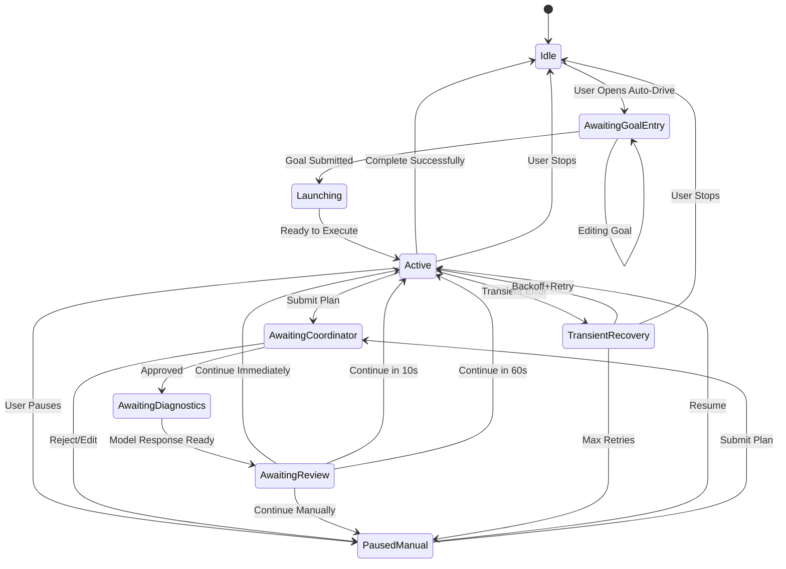
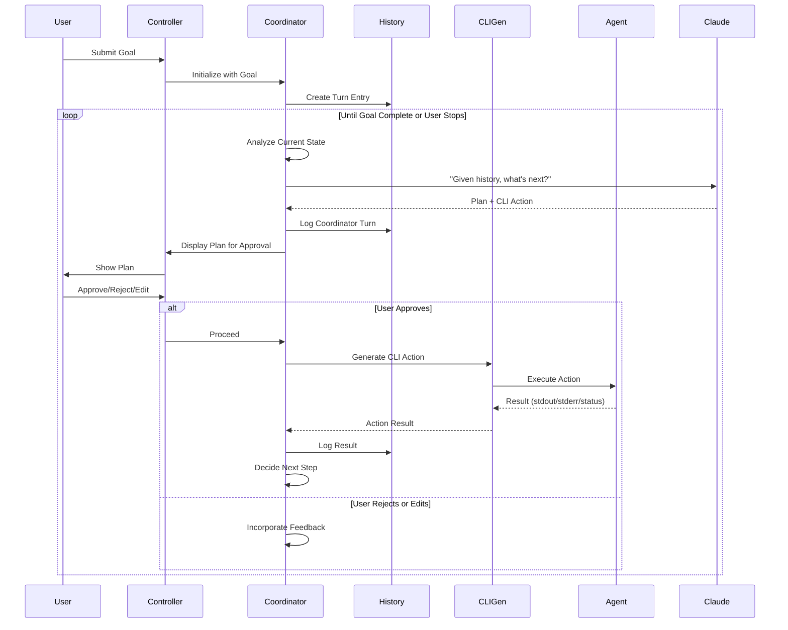
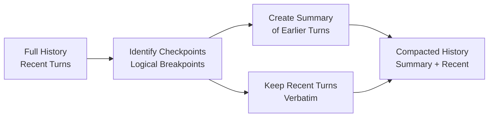
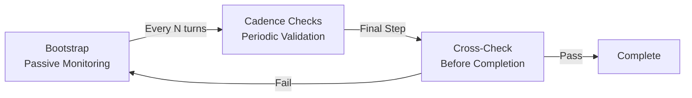

# Auto-Drive Architecture

Auto-Drive is the autonomous task orchestration system at the heart of kode. It coordinates multi-step workflows, manages AI agent interactions, handles intelligent error recovery, and automates decision-making. This document provides a comprehensive technical overview of how Auto-Drive is architected and implemented.

## System Overview

Auto-Drive enables users to specify complex goals and let the system autonomously execute them through iterative planning, execution, and refinement cycles. The system consists of several interconnected components that work together to:

1. **Understand user intent** through natural language goal descriptions
2. **Plan next steps** using the Claude AI coordinator
3. **Execute tasks** by generating and running CLI actions
4. **Manage state** across multiple turns with conversation history
5. **Handle failures** gracefully with intelligent retry logic
6. **Optimize context** by compacting conversation history to fit token limits
7. **Validate progress** through automated quality assurance

## High-Level Architecture



## Core Components

### 1. Controller (`controller.rs` - 32KB)

The Controller is the state machine that manages the Auto-Drive lifecycle. It orchestrates transitions between different execution phases and coordinates communications between the TUI and the coordinator.

#### AutoRunPhase State Machine

Auto-Drive executes through a well-defined state machine with 9 distinct phases:



**Phase Descriptions:**

| Phase | Purpose | User Actions | Next Phase |
|-------|---------|--------------|-----------|
| **Idle** | No active run | Open goal panel | AwaitingGoalEntry |
| **AwaitingGoalEntry** | Goal input panel visible | Edit/submit goal | Launching |
| **Launching** | Preparing first turn | (automatic) | Active |
| **Active** | Normal execution | Submit plan, pause, stop | AwaitingCoordinator, PausedManual |
| **AwaitingCoordinator** | Waiting for user approval | Approve, reject, edit | AwaitingDiagnostics, PausedManual |
| **AwaitingDiagnostics** | Model generating response | (automatic) | AwaitingReview |
| **AwaitingReview** | Result ready for action | Choose continue option | Active, PausedManual |
| **PausedManual** | User-paused execution | Resume, edit, submit | Active, AwaitingCoordinator |
| **TransientRecovery** | Recovering from error | (automatic backoff) | Active, PausedManual |

#### Continue Modes

After the model generates a plan, users choose how to proceed:

- **Immediate**: Execute the next action immediately
- **10 seconds**: Wait 10 seconds then auto-execute
- **60 seconds**: Wait 60 seconds then auto-execute
- **Manual**: Wait for explicit user approval

#### Restart Logic

When transient failures occur:

1. First failure: Immediate 1-second backoff
2. Subsequent failures: Exponential backoff (2s, 4s, 8s, 16s, 32s)
3. Max 6 retry attempts before requiring manual intervention
4. User can abort or retry during recovery phase

### 2. Auto Coordinator (`auto_coordinator.rs` - 87KB)

The Coordinator is the planning engine powered by Claude AI (GPT-5). It's the "brain" of Auto-Drive, responsible for understanding goals, making decisions, and generating the next actions.

#### Architecture



#### Key Responsibilities

1. **State Analysis**: Reads conversation history and current context
2. **Planning**: Calls Claude to decide next steps
3. **Decision Making**: Routes user input and generates appropriate actions
4. **Context Management**: Monitors token usage and requests compaction when needed
5. **Error Recovery**: Implements retry logic with exponential backoff
6. **Rate Limiting**: Handles Claude API rate limits gracefully
7. **Metrics Collection**: Tracks token usage and session statistics

#### Claude Integration

The Coordinator maintains an ongoing conversation with Claude that includes:

- **System Prompt**: Describes Auto-Drive's capabilities and constraints
- **Conversation History**: Complete turn-by-turn transcript
- **Current Context**: Recent actions and their results
- **User Feedback**: User-provided corrections or guidance

Each turn:

```
User: Goal description or feedback
Coordinator: Sends history to Claude
Claude: Analyzes and returns:
  - Thinking/reasoning
  - Next CLI action to execute
  - Expected outcome
Coordinator: Logs response and displays to user
```

#### Events Emitted

The Coordinator publishes events for TUI consumption:

- **Decision**: Planning output ready for approval
- **Thinking**: Coordinator is analyzing (used for UI feedback)
- **UserReply**: User message incorporated
- **TokenMetrics**: Token usage update
- **CompactedHistory**: History was compacted

### 3. Auto-Drive History (`auto_drive_history.rs` - 17KB)

Manages the complete conversation transcript between the user, coordinator, and Claude. This is the single source of truth for the Auto-Drive session.

#### Responsibilities

1. **Message Storage**: Maintains chronological transcript
2. **Deduplication**: Prevents duplicate messages
3. **Turn Management**: Tracks multi-turn conversations
4. **Metrics Aggregation**: Collects session-level statistics
5. **History Retrieval**: Provides formatted history for coordinator

#### Data Structure

```
Session
├── Turn 1
│   ├── User Input
│   ├── Coordinator Response
│   ├── Action Executed
│   └── Result
├── Turn 2
│   ├── User Input
│   ├── Coordinator Response
│   ├── Action Executed
│   └── Result
└── Session Metrics
    ├── Total Tokens
    ├── Total Turns
    └── Elapsed Time
```

### 4. Auto Compact (`auto_compact.rs` - 17KB)

Manages token context by intelligently compacting conversation history when approaching token limits. This allows Auto-Drive to handle long-running tasks without losing important context.

#### Compaction Strategy



#### Algorithm

1. **Token Estimation**: Counts tokens (4 bytes per token approximation)
2. **Checkpoint Identification**: Finds logical breakpoints in history
3. **Summary Generation**: Creates concise summary of earlier turns
4. **Preservation**: Keeps recent N turns in full detail
5. **Validation**: Ensures compacted history fits within token limit

#### Token Budgeting

- Input token limit: 200,000 tokens (Claude model limit)
- Compaction triggers at 75% capacity
- Recent 10 turns always kept verbatim
- Summary preserves key decisions and outcomes

### 5. Coordinator Router (`coordinator_router.rs` - 4KB)

Routes user messages to appropriate handlers based on content. Enables quick responses to common queries without calling Claude.

#### Routing Rules

| Pattern | Handler | Purpose |
|---------|---------|---------|
| `status`, `where am i` | Status Query | Current phase and summary |
| `plan`, `next` | Plan Request | Display current plan |
| `stop`, `abort` | Stop Command | Graceful termination |
| `other` | Coordinator | Full Claude reasoning |

This provides sub-100ms responses for common queries while delegating complex reasoning to Claude.

### 6. Retry Manager (`retry.rs` - 5KB)

Implements resilient error handling with exponential backoff for transient failures.

#### Backoff Strategy

```
Attempt 1: Fail → Wait 1s
Attempt 2: Fail → Wait 2s
Attempt 3: Fail → Wait 4s
Attempt 4: Fail → Wait 8s
Attempt 5: Fail → Wait 16s
Attempt 6: Fail → Wait 32s
Attempt 7: Manual intervention required
```

#### Features

- **Jitter**: Random variation (±10%) to prevent thundering herd
- **Cancellation**: User can abort retry loop at any time
- **Status Callbacks**: TUI receives updates during backoff
- **Rate Limit Handling**: Special handling for 429 responses

### 7. Session Metrics (`session_metrics.rs` - 3KB)

Collects telemetry about Auto-Drive sessions.

#### Tracked Metrics

- **Token Usage**: Input, output, and total tokens per turn
- **Turn Count**: Number of coordinator interactions
- **Elapsed Time**: Wall-clock session duration
- **Error Count**: Failures and retries
- **Completion Status**: Successful completion vs. abortion

## TUI Integration

Auto-Drive integrates with the TUI through several specialized components:

### Goal Entry Panel

Located in the chat input area, allows users to:
- Describe their goal in natural language
- Review previously executed goals
- Edit and re-run goals

### Coordinator View (Bottom Pane)

Displays:
- **Current Goal**: What Auto-Drive is trying to accomplish
- **Status**: Current phase and elapsed time
- **Pending Plan**: Next action awaiting approval
- **Countdown Timer**: For auto-submission modes
- **Action Buttons**: Approve, reject, edit, continue options

### History Cells

Special history cells showing:
- **Card Title**: Goal description
- **Status Badge**: Running/Paused/Failed/Complete
- **Action Log**: Timestamp-annotated actions
- **Completion Animation**: Celebration effect when done
- **Gradient Effects**: Visual progression through phases

### Auto-Drive Cards

Higher-level card abstraction managing:
- **Card Lifecycle**: Creation, updates, completion
- **Session Tracking**: Multiple concurrent Auto-Drive sessions
- **Card Persistence**: Long-term session tracking

## Auto QA Orchestration

Auto-Drive includes automated quality assurance to validate execution quality and catch issues before user review.

### Observer Lifecycle



### Bootstrap Phase

- **Duration**: First coordinator turn
- **Tool Access**: Read-only operations only
- **Purpose**: Initialize observer, gather baseline state
- **Example**: `ls`, `pwd`, `git status` (safe inspection)

### Cadence Phase

- **Frequency**: Every `CODE_QA_CADENCE` turns (default: 3)
- **Tool Access**: Limited safe operations
- **Purpose**: Periodic health checks
- **Example**: Verify build still compiles, tests still pass

### Cross-Check Phase

- **Trigger**: Before marking completion
- **Tool Access**: Full audit capabilities
- **Purpose**: Final validation before user review
- **Example**: Full test suite execution, comprehensive validation

### Configuration

```bash
CODE_QA_CADENCE=3              # Turns between observer checks
CODE_QA_REVIEW_COOLDOWN_TURNS=1 # Turns before review request
```

## Error Handling

Auto-Drive distinguishes between error types:

### Transient Errors

Temporarily retried with exponential backoff:
- Network timeouts
- Rate limiting (429)
- Temporary service unavailability
- Resource contention

Recovery: Automatic retry with backoff, max 6 attempts

### User-Recoverable Errors

Require user feedback:
- Invalid goal specification
- Ambiguous instructions
- Contradictory requirements

Recovery: Controller transitions to `PausedManual` for editing

### Terminal Errors

Require manual intervention:
- Invalid credentials
- Permissions issues
- Configuration problems

Recovery: User must edit and restart

## Token Management

Auto-Drive implements sophisticated token management:

### Token Tracking

- Each turn logs input and output tokens
- Running total maintained in session metrics
- 4-byte approximation for quick estimation

### Compaction Triggers

1. **Threshold**: Token usage > 75% of limit
2. **Initiated By**: Coordinator detects threshold
3. **Compaction Process**: Summarizes older turns, keeps recent turns
4. **Result**: History fits within token limits for next turn

### Context Window Strategy

- **Preserve**: Recent 10 turns in full detail
- **Summarize**: Older turns compressed to key decisions
- **Drop**: Very old turns if necessary for fit

## Development and Testing

### Fault Injection (`faults.rs`)

Behind `dev-faults` feature flag, allows testing error scenarios:

```rust
#[cfg(feature = "dev-faults")]
simulate_network_error()?;

#[cfg(feature = "dev-faults")]
simulate_rate_limit()?;
```

### Local Testing

Test Auto-Drive with realistic scenarios:

1. Long-running goal (triggers compaction)
2. Network failure (triggers retry)
3. User interruption (tests state cleanup)
4. Complex multi-step workflow (tests planning)

## Performance Characteristics

### Latency

- **Goal Submission to First Plan**: 2-5 seconds (Claude latency)
- **Status Query**: <100ms (routed query)
- **Phase Transitions**: <50ms (state machine)
- **History Compaction**: 500-1000ms for large histories

### Token Efficiency

- **Typical Goal**: 5,000-10,000 tokens for complete session
- **Complex Goal**: 50,000-100,000 tokens possible
- **Compaction Overhead**: ~10% token reduction per compaction

### Scalability

- **Concurrent Sessions**: Limited only by TUI capacity
- **Turn Depth**: Unlimited (compaction handles arbitrarily long sessions)
- **History Size**: Multi-megabyte histories supported

## Integration Points

Auto-Drive integrates with:

1. **Claude AI**: For planning and decision-making
2. **Agent Executor**: For running generated CLI actions
3. **TUI**: For user interaction and visualization
4. **History System**: For conversation persistence
5. **Configuration System**: For user preferences

## Future Enhancements

Potential improvements to Auto-Drive architecture:

1. **Distributed Execution**: Run multiple parallel action sequences
2. **Learning**: Refine decision-making based on outcomes
3. **Tool Integration**: Custom tool definitions for domain-specific tasks
4. **Observability**: Enhanced tracing and debugging tools
5. **Multi-Agent Coordination**: Collaborative agent workflows

## References

- [State Inventory](../../auto-drive-state-inventory.md) - Detailed state management
- [Phase Migration](../../auto-drive-phase-migration-TODO.md) - Migration guide
- [Auto QA Documentation](../../auto-qa.md) - Quality assurance details
- Source: `code-rs/code-auto-drive-core/`
